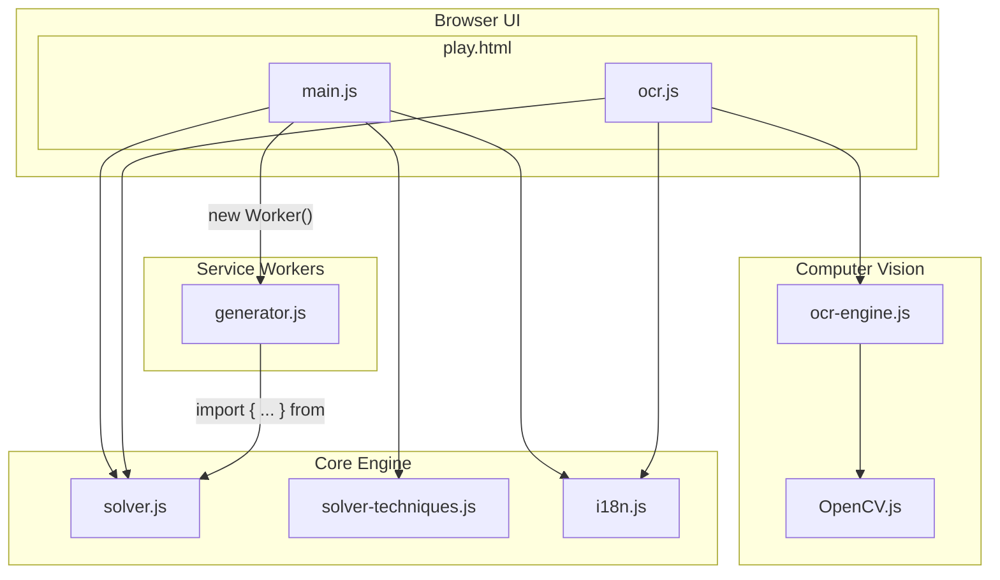

# Antigravity Sudoku — Architecture

## Overview

A fully client-side Sudoku game running in the browser.  
No build step or server logic required. All game logic, OCR, and puzzle generation run locally in the browser.

---

## File Map

```
sudoku/
├── index.html            # About page (landing)
├── play.html             # Main game entry point
├── heatmap.html          # Heatmap analysis tool
├── css/                  # Modern CSS architecture using @layers
│   ├── tokens.css        # Centralized design tokens (Primitive & Semantic variables)
│   ├── base.css          # Reset styles and global layout within @layer base
│   ├── board.css         # Game board and cell styles within @layer components
│   ├── ui.css            # UI components (buttons, etc.) within @layer components/states
│   ├── modal.css         # Modal and dialog styles within @layer components
│   └── heatmap.css       # Heatmap specific styles within @layer components
└── js/                   # All logic scripts (ES Modules)
    ├── main.js           # Consolidated UI logic & Worker Orchestrator
    ├── solver.js         # Engine core (DLX, BitUtils, LogicalSolver base)
    ├── solver-techniques.js # Advanced human-like techniques
    ├── generator.js      # Worker entry point & Generation logic (Module Worker)
    ├── ocr-engine.js     # OpenCV-based grid detection (GridDetector)
    ├── ocr.js            # OCR pipeline & Image import UI
    ├── heatmap.js        # Heatmap specific logic
    └── i18n.js           # Internationalization (JA / EN)
```

---

## File Roles

### `play.html`
The single HTML game entry point.  
Loads all scripts in dependency order and defines the full DOM structure:
game board, keypad, memo toggle, undo/redo buttons, settings bar, and OCR modal.

### `index.html`
The landing and overview page. Provides an introduction to the project's features and technical background, with a direct link to `play.html`.

**Module imports:**
```javascript
// play.html loads:
import 'js/main.js';
import 'js/ocr.js';

// Internal dependencies:
main.js ─────────► solver.js
main.js ─────────► i18n.js
main.js ─────────► solver-techniques.js
ocr.js  ─────────► solver.js
ocr.js  ─────────► ocr-engine.js
ocr.js  ─────────► i18n.js
generator.js  ───► solver.js (Loaded as Module Worker)
```

---

### `css/ (Modern Layered Styles)`
The application uses a robust CSS architecture based on **CSS `@layer`** (`base`, `components`, `states`) to manage cascade priority without `!important` hacks. 

- `tokens.css`: **The source of truth for design.** Defines a 2-tier variable system:
    - **Primitive Palette**: Specific color values (e.g., `--palette-blue-300`).
    - **Semantic Tokens**: Purpose-driven aliases (e.g., `--btn-bg`, `--accent-color`).
- `base.css`: Contains reset styles and high-level layout (`@layer base`).
- `board.css`: Handles the 9x9 grid, cell rendering, and memo displays (`@layer components`).
- `ui.css`: Manages interactive components like buttons and toggles, separating structural styles (`@layer components`) from state-dependent styles like `.active` or `:disabled` (`@layer states`).
- `modal.css`: Styling for the OCR upload and manual correction dialogs (`@layer components`).
- `heatmap.css`: Layout and visualization for the heatmap analysis tool (`@layer components`).

---

### `i18n.js`
Internationalization module.  
Defines `translations` object with `ja` and `en` keys.
- `t(key)` — returns the translated string for the current language
- `applyLanguage(lang)` — updates all `data-i18n` elements in the DOM and persists selection to `localStorage`

---

### `solver-techniques.js`
A heavy-duty logical analysis module used solely on the **Main Thread**. It defines the full suite of human-like Sudoku techniques. Workers avoid loading this file to minimize startup overhead and memory usage.

- `TECHNIQUES` — array of technique objects `{ name, rank, checkBitwise, applyLogical }`
- `TECH_BY_RANK` — pre-sorted dictionary for zero-allocation access in tight loops.
- `LogicalRules.analyzeFull(solver)` — authoritative "Waterfall Reset" evaluator used by Main Thread and Orchestrator.

**Must be loaded AFTER `solver.js` (uses shared `DIFFICULTY_RANK` and engine definitions).**

---

### `solver.js`
The engine core containing three high-performance modules.

#### 1. `SudokuDLX` (Backtracking & Uniqueness)
Uses **TypedArrays** (Int32Array/Uint8Array) to implement the Dancing Links (DLX) algorithm with a **pointer-less, fixed-memory architecture**. This zero-allocation design allows for extreme speed during deep searches.
- `applyGrid(grid)` — Resets and applies a 1D grid to the internal constraint matrix.
- `countSolutions(grid, limit)` — Fast unique solution check. **Optimized with Dirty Return (Short-circuiting)**: if the limit is reached, it skips the expensive `uncover` stack and returns immediately, relying on the caller to reset state via `applyGrid`.
- `solveAndFill(grid)` — Fills a 1D grid with a valid solution.

#### 2. `SudokuBitLogicalSolver` (Ultra-Fast Evaluation)
A bit-parallel logical engine using bitwise operations and optimized `popcount`.
- `evaluate(grid, targetRank)` — **Waterfall Reset Simulation**: instead of a simple probe, it simulates the entire solve until completion or impasse to verify the puzzle is solvable within the target rank.
- `fillSinglesInternal()` — core bitwise routine for rapid Singles elimination.

#### 3. `SudokuLogicalSolver` (Production & Advanced Metrics)
The high-level coordinator used in the Web Worker to generate and shape puzzles.
- `generateSinglePattern(difficulty)` — Implements the **Revolutionary Two-Phase** engine:
    - **Phase 1: Smoothing (地ならし)**: Rapid structural reduction by removing cells that have an **INF Level of 0 or 1** (cells whose removal doesn't break uniqueness or only creates simple mutual dependency pairs). This "thins out the fat" while preserving the "logical skeleton".
    - **Phase 2: Exploration (探索)**: A wide search across the smoothed skeleton to find the minimal configuration that triggers the target difficulty.
    - **Efficiency**: Gauges difficulty (BitSolver) only once per candidate node; utilizes DLX for final uniqueness validation.
- `solveByRank(targetRank)` — Uses the traditional technique-based approach for precise difficulty classification.
- `SudokuOrchestrator` — **Stateful Pre-generation & replenishment**:
    - Starts generating puzzles as soon as a difficulty button is clicked (leveraging user intent time).
    - Maintains a **Target Count (4)** of "Verified Logic" puzzles.
    - Implements a **Replenish Model**: Worker finishes 1 puzzle → Orchestrator checks quality → immediately requests 1 more until the pool is full.
    - **No Compromise**: Only puzzles that pass the "Waterfall Reset" verification are accepted.
- `worker.js` — **Loop-based Parallel Processing**:
    - Executes generation in continuous loops based on a `count` parameter to minimize communication overhead.
    - Uses **Transferable Objects** for zero-copy data exchange.

---

### `js/main.js`
The central hub for UI logic and state management. Merged from `script.js` and `orchestrator.js`.
- Manages `unifiedBoard` (32-bit state) and `undoStack`.
- Implements `SudokuOrchestrator` for parallel worker pooling.
- Handles all UI event listeners (Keypad, Keyboard, Reset, Rocket).
- Communicates with `ocr.js` via the `ocr:complete` custom event.

### `js/generator.js`
The entry point for background threads. Replaces `worker.js`.
- Runs as an **ES Module Worker**.
- Imports `solver.js` to execute generation logic.
- Maintains a persistent message loop, responding to `GENERATE` tasks from the `Orchestrator`.

---

### `js/ocr-engine.js` (Renamed from grid-detector.js)
OpenCV.js-based image analysis. Extracts cell images from a sudoku photo.

**Class: `GridDetector`**
Method: `detect(canvas, onProgress)` — crop grid → split → binarize → group similar cells.

**Depends on:** OpenCV.js (Dynamic loading)

---

### `js/ocr.js`
OCR pipeline using Tesseract.js.
- Orchestrates `GridDetector` and Tesseract workers.
- Implements manual correction cache & validation logic.
- Uses `SudokuLogicalSolver.evaluate` from the main memory sandbox.

**Depends on:** `js/solver.js`, `js/ocr-engine.js`

---

## Dependency Graph



---

## Data Flow (Normal Game)

```
initGame(difficulty)
  → generatePuzzle()                    # P-Core Optimized Orchestrator (in main.js)
      → js/generator.js: generateSinglePattern()
          → Phase 1 (Smoothing): Remove INF0/INF1 clues to expose logical "bones".
          → Phase 2 (Exploration): Search for the target rank within the skeleton.
          → Engine-Direct: Calls BitUtils/DLX directly to eliminate `probe` call overhead.
      → On-Demand Selection: Min-hints & Max-complexity score
  → renderBoard()
```

## Data Flow (OCR Import)

```
Image upload
  → GridDetector.detect()     # OpenCV: crop, split, binarize, group
  → Tesseract per group       # OCR each unique digit group
  → countSolutions(limit=2)   # DLX uniqueness check
  → applyGridToBoard()
```
